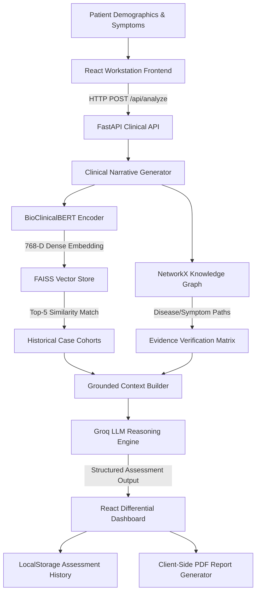

# MedAssist AI

### AI-Assisted Clinical Decision Support System
**Clinical NLP + Retrieval-Augmented Generation + Knowledge Graph Reasoning**

MedAssist AI is an advanced research and educational Clinical Decision Support System (CDSS) prototype designed to assist healthcare professionals by analyzing complex patient presentations and generating evidence-grounded differential assessments. By combining domain-specific clinical embeddings, vector similarity search, structured graph verification, and Large Language Model (LLM) reasoning, MedAssist AI delivers transparent, interpretable, and reproducible clinical decision support.

---

## 📌 Overview

Traditional diagnostic assistance models often operate as opaque "black boxes" or rely purely on ungrounded language model prompts. MedAssist AI addresses these challenges through a hybrid multi-layer clinical reasoning architecture:

1. **BioClinicalBERT**: Generates dense 768-dimensional clinical semantic embeddings from patient narratives.
2. **FAISS Vector Retrieval**: Conducts sub-millisecond similarity searches across **10,000 historical case cohorts** derived from the DDXPlus dataset.
3. **NetworkX Knowledge Graph**: Verifies structured disease-evidence relationships across **271 nodes and 888 directed edges**.
4. **Groq LLM (`llama3-70b-8192`)**: Synthesizes retrieved evidence, graph pathways, and candidate conditions into a structured, evidence-grounded differential assessment.
5. **Modern React Dashboard**: Presents candidate conditions, evidence verification matrices, historical case matches, similarity percentages, and exportable PDF reports.

---

## 🎯 Problem Statement

Clinical decision support tools face several key engineering and algorithmic challenges:

* **Semantic Complexity**: Clinical narratives contain dense, unstructured text where traditional keyword matching fails to capture subtle symptom interactions.
* **LLM Hallucinations**: Standard LLMs can generate plausible yet ungrounded diagnostic claims if not constrained by verified medical facts.
* **Lack of Interpretability**: Clinicians require clear evidence pathways—such as matched vs. missing symptoms and historical precedent—rather than isolated condition predictions.
* **Performance & Scale**: Similarity retrieval over thousands of patient cohorts requires sub-millisecond vector indexing.

---

## 💡 Proposed Solution

MedAssist AI implements a hybrid pipeline where every stage reinforces clinical explainability:

```
Patient Input  ──►  BioClinicalBERT (768-D)  ──►  FAISS (Top-5 Cohorts)
                                                          │
                                                          ▼
React Dashboard  ◄──  Groq LLM Synthesizer  ◄──  NetworkX Knowledge Graph
```

* **BioClinicalBERT** captures deep domain-specific medical semantics.
* **FAISS** grounds reasoning in similar historical patient cases.
* **NetworkX Knowledge Graph** validates candidate conditions against deterministic clinical rules.
* **Groq LLM** synthesizes all retrieved context without generating ungrounded diagnoses.
* **React + shadcn/ui** provides a polished, interactive workstation for clinical review.

---

## 🏗️ System Architecture



---

## 🔬 Clinical Reasoning Pipeline

### 1. Patient Intake & Narrative Generation
The clinician inputs patient demographics (age, sex), presenting symptoms, and optional narrative notes. The backend synthesizes structured inputs into a normalized clinical presentation text string.

### 2. BioClinicalBERT Representation
Using `Emilyalsentzer/Bio_ClinicalBERT`, the clinical narrative is tokenized (max sequence length 128) and passed through transformer layers. Mean pooling over token embeddings produces a **768-dimensional dense vector**, which is $L_2$-normalized for exact cosine similarity calculation.

### 3. FAISS Vector Retrieval
The normalized vector is queried against a FAISS `IndexFlatIP` vector index containing **10,000 indexed clinical cases**. The retriever extracts the **Top-5 most similar historical cohorts**, complete with retrieved ground-truth diagnoses and similarity scores (e.g., 88.7%).

### 4. Knowledge Graph Evidence Verification
A compiled NetworkX directed graph (`medical_graph.pkl`) containing **49 disease nodes**, **222 symptom/evidence nodes**, and **888 directed edges** evaluates the candidate conditions. For each condition, the graph categorizes findings into:
* **Matched Evidence** (`✓`): Presenting symptoms that support the condition.
* **Not Reported / Additional** (`○`): Expected path symptoms not reported by the patient.
* **Contradictory** (`!`): Findings that conflict with typical presentation.

### 5. Groq LLM Reasoning Synthesis
The grounded prompt—containing patient metrics, FAISS cohort statistics, and Knowledge Graph evidence matrices—is sent to Groq (`llama3-70b-8192`) at a low temperature ($0.1$). The LLM formats the response into a structured JSON differential assessment including candidate rankings, severity, ICD-10 codes, clinical rationale, and alternative diagnoses.

---

## 📊 Knowledge Graph & RAG Statistics

| Metric | Value | Source / Description |
| :--- | :--- | :--- |
| **Embedding Model** | `Bio_ClinicalBERT` | 768-D dense vectors via mean-pooling |
| **FAISS Cohort Index** | 10,000 cases | L2-normalized Inner Product (`IndexFlatIP`) |
| **Top-$k$ Retrieval** | 5 cases | Nearest-neighbor historical cohort matches |
| **Knowledge Graph Nodes** | 271 nodes | 49 Disease nodes + 222 Symptom nodes |
| **Knowledge Graph Edges** | 888 edges | Directed `has_symptom` and `has_antecedent` edges |
| **Metadata Source** | DDXPlus Dataset | Cleaned clinical questions & disease definitions |

---

## 🚀 Key Application Features

### 🩺 Clinical Assessment Workstation
* Interactive intake panel supporting age, sex selection, quick-add symptom chips, symptom search, and narrative notes.
* Active stepper loader visualizing real-time analysis pipeline progress.

### 📈 Ranked Differential & Explainability Dashboard
* **Candidate Conditions**: Expandable cards displaying rank (`01`, `02`), normalized ICD-10 codes (e.g., `J47`), severity scores, and matched vs. unreported evidence.
* **Knowledge Graph Evidence Matrix**: Compact evidence matrix comparing findings across top conditions with status badges.
* **Similar Historical Cases**: Interactive table featuring percentage match bars and modal views of full cohort symptom profiles.
* **Clinical Rationale**: AI-grounded reasoning paragraph with badged alternative conditions.
* **Methodology Pipeline**: Visual 6-step flowchart explaining system processing.

### 📄 Client-Side PDF Clinical Assessment Report
* Generates professional, multi-page clinical reports via `jsPDF` / `html2canvas`.
* Includes patient profile, confidence metrics, differential diagnoses table, Knowledge Graph evidence, and historical cohort comparisons.
* Runs 100% client-side without calling backend endpoints.

### 📜 Persistent Assessment History
* Saved automatically in browser `localStorage` (`medassist_assessment_history`).
* Instant client-side search across assessment ID, age, sex, symptoms, and diagnoses.
* Filter by confidence level (`High`, `Medium`, `Low`) and sort by date (`Newest`, `Oldest`).
* Re-opens saved assessments instantly with **zero API requests**.
* Supports individual item deletion and complete history clearing with confirmation dialogs.

---

## ⚡ Efficient API Usage

To ensure optimal API consumption on free-tier LLM services, MedAssist AI minimizes external network calls:

* **Single Request Model**: `/api/analyze` is called **only** when the user explicitly clicks **"Analyze Clinical Case"**.
* **Cached Results**: Results are stored in React application state and browser `localStorage`.
* **Zero-Request Actions**: Viewing historical assessments, filtering, sorting, searching, opening dialogs, expanding evidence accordions, and downloading PDF reports trigger **0 API calls**.

| User Action | New Groq API Call |
| :--- | :---: |
| **Click "Analyze Clinical Case"** | **Yes (1 request)** |
| **View Results Dashboard** | **No** |
| **Navigate Tabs (Dashboard / Methodology / About)** | **No** |
| **Open Saved Assessment from History** | **No** |
| **Search / Filter / Sort History** | **No** |
| **Download PDF Clinical Report** | **No** |
| **Open Reasoner / Case Modals** | **No** |

---

## 🛠️ Technology Stack

| Layer | Technology |
| :--- | :--- |
| **Clinical NLP Embeddings** | BioClinicalBERT (`Emilyalsentzer/Bio_ClinicalBERT`), PyTorch, Transformers |
| **Vector Similarity Search** | FAISS (`faiss-cpu`), NumPy |
| **Knowledge Graph** | NetworkX (`DiGraph`), DDXPlus Dataset Metadata |
| **LLM Reasoning** | Groq API (`llama3-70b-8192`), `groq` Python SDK |
| **Backend API** | Python 3.10+, FastAPI, Pydantic v2, Uvicorn |
| **Frontend Web App** | React 18, TypeScript, Vite |
| **Styling & Components** | Tailwind CSS, shadcn/ui, Lucide React, Framer Motion |
| **PDF Generation** | jsPDF, html2canvas, jsPDF-AutoTable |
| **Local Persistence** | Browser `localStorage` |

---

## 📂 Repository Structure

```
AI-CDSS/
├── backend/
│   ├── api/
│   │   └── main.py              # FastAPI endpoints & CORS configuration
│   ├── app/
│   │   └── pipeline.py          # Unified clinical reasoning coordinator
│   ├── knowledge_graph/
│   │   ├── graph_builder.py     # NetworkX graph construction from DDXPlus
│   │   ├── graph_queries.py     # KG evidence verification logic
│   │   └── medical_graph.pkl    # Serialized graph binary (271 nodes, 888 edges)
│   ├── llm/
│   │   ├── llm_client.py        # Groq API client initialization
│   │   ├── prompt_builder.py    # Grounded clinical prompt generator
│   │   └── reasoning.py         # Response parsing & fallback handling
│   ├── rag/
│   │   ├── embeddings.py        # BioClinicalBERT mean-pooling encoder
│   │   ├── retriever.py         # Case retriever wrapper
│   │   ├── vector_store.py      # FAISS IndexFlatIP management
│   │   └── faiss_index/         # Indexed 10,000 cases & metadata
│   └── tests/                   # Backend verification test scripts
├── frontend/
│   ├── src/
│   │   ├── components/
│   │   │   ├── assessment/      # Patient form & progress stepper
│   │   │   ├── layout/          # Sidebar navigation shell
│   │   │   ├── pipeline/        # Methodology timeline component
│   │   │   ├── results/         # Differential, KG, Case table, Rationale components
│   │   │   └── ui/              # shadcn/ui primitive components
│   │   ├── lib/
│   │   │   └── pdfGenerator.ts  # Client-side PDF report generator
│   │   ├── pages/
│   │   │   ├── Dashboard.tsx    # Operational metrics overview
│   │   │   ├── NewAssessment.tsx# Assessment workstation page
│   │   │   ├── AssessmentHistory.tsx # Saved cases & history management
│   │   │   ├── Methodology.tsx  # Architecture documentation page
│   │   │   └── About.tsx        # System scope & safety disclosure
│   │   ├── services/
│   │   │   └── api.ts           # Axios backend API client
│   │   ├── App.tsx              # Root application state & tab routing
│   │   └── index.css            # Tailwind & custom CSS utility styles
│   ├── package.json
│   └── vite.config.ts
├── docs/                        # Phase documentation & architecture guides
├── README.md                    # Project documentation
└── .gitignore
```

---

## 💻 Installation & Setup

### Prerequisites
* **Python**: 3.10 or higher
* **Node.js**: v18.0 or higher
* **npm**: v9.0 or higher
* **Groq API Key**: Obtainable from [console.groq.com](https://console.groq.com/)

---

### 1. Backend Setup

```bash
# Navigate to project root
cd AI-CDSS

# Create and activate virtual environment
python -m venv .venv

# Windows activation:
.venv\Scripts\activate
# Linux/macOS activation:
# source .venv/bin/activate

# Install backend dependencies
pip install -r backend/requirements.txt
```

Create a `.env` file in the project root:

```env
GROK_API_KEY=your_groq_api_key_here
GROQ_MODEL=llama3-70b-8192
```

Start the FastAPI backend server:

```bash
uvicorn backend.api.main:app --host 0.0.0.0 --port 8000 --reload
```

The API will be available at `http://localhost:8000` (Swagger docs at `http://localhost:8000/docs`).

---

### 2. Frontend Setup

```bash
# Navigate to frontend directory
cd frontend

# Install frontend dependencies
npm install

# Start Vite development server
npm run dev
```

The application will be running at `http://localhost:5173`.

---

## 🛠️ Project Evolution & Development Phases

* **Phase 1: Clinical Data Preprocessing**: Extracted and normalized symptom questions, disease definitions, and antecedent history from the DDXPlus clinical dataset.
* **Phase 2: RAG & FAISS Vector Store**: Built BioClinicalBERT mean-pooling encoder and indexed 10,000 cases into FAISS `IndexFlatIP` for sub-millisecond similarity retrieval.
* **Phase 3: Medical Knowledge Graph**: Constructed NetworkX directed graph (271 nodes, 888 edges) mapping disease-symptom relationships and evidence verification.
* **Phase 4: Groq LLM Reasoning**: Integrated Groq API (`llama3-70b-8192`) with grounded prompt templates to output structured JSON differential assessments.
* **Phase 5.1: PDF Clinical Report**: Developed client-side multi-page report generator (`jsPDF` / `html2canvas`) containing complete assessment details.
* **Phase 5.2: Clinical Results UI Redesign**: Redesigned Results page into a modern healthcare SaaS dashboard with compact cards, evidence matrices, and confidence dials.
* **Phase 5.3: Persistent Assessment History**: Built localStorage-backed Assessment History page with search, confidence filtering, date sorting, case reopening, and deletion controls.

---

## ⚠️ Safety Notice & Usage Limitations

> **IMPORTANT DISCLAIMER**  
> MedAssist AI is an AI-assisted clinical decision support research and educational prototype. It is **not** a certified medical device and is **not** intended to provide formal medical diagnosis, replace clinical judgment, guide emergency treatment decisions, or substitute for consultation with qualified healthcare professionals.

* **Data Scope**: Diagnostic suggestions are limited to the clinical knowledge base and synthetic cohort distributions represented in the DDXPlus dataset.
* **LLM Output Verification**: All language model outputs are grounded in retrieved context but should be independently reviewed by clinicians.
* **Demonstration Safety**: For testing and demonstration, use synthetic or non-sensitive patient metrics.

---

## 📄 License

This project is developed for research and educational purposes. All dataset rights belong to their respective authors (DDXPlus / Figshare).
